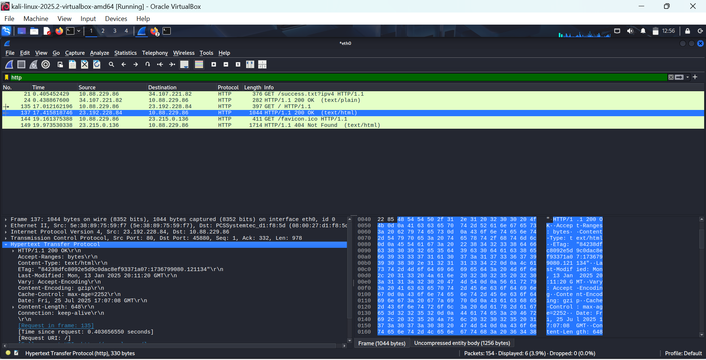

# wireshark-http-analysis
A hands-on project to analyze HTTP traffic using Wireshark

# 🕵‍♂ HTTP Traffic Analysis using Wireshark

## 📌 Project Overview
This project demonstrates how HTTP traffic can be captured and analyzed using *Wireshark*. The goal is to understand how data is transmitted in plaintext over HTTP and how easily sensitive information can be extracted.

---

## 🎯 Objective
- Capture HTTP traffic from a website using Wireshark
- Inspect unencrypted data such as requests, responses, and headers
- Understand the risks of using HTTP instead of HTTPS

---

## 🛠 Tools Used
- *Wireshark* – Packet capture and analysis tool
- *Kali Linux* – OS used for network analysis
- *Browser* – Accessed http://example.com to simulate HTTP traffic

---

## 🧪 How to Reproduce This
1. Open Wireshark and select the appropriate network interface (e.g., eth0)
2. Apply a capture filter: http
3. Visit an unencrypted HTTP site, such as:  
   http://example.com
4. Stop capture after the page loads
5. Analyze the packets – look for GET, POST, and HTTP response headers

---

## 📸 Screenshot

---

## 📦 Packet Capture File
You can download and inspect the capture file using Wireshark:  
➡ http_packet_analysis.pcapng

---

## 🧠 Key Learnings
- HTTP traffic is *not encrypted* – credentials, cookies, and internal IPs are exposed.
- Understanding HTTP packet structure is crucial for *network forensics*.
- Wireshark is a powerful tool to visualize and inspect *real-time communication*.

---

## 🚀 Next Steps
- Analyze HTTP POST data (form submissions)
- Simulate HTTPS traffic and try intercepting with tools like mitmproxy
- Build a cheat sheet for useful capture and display filters

---

## 👨‍💻 Author
*Naveen Sharath*  
Cybersecurity Enthusiast | Ethical Hacker in Training  
[GitHub Profile](https://github.com/NaveenSharath)

---

## 📜 License
This project is licensed under the [MIT License](LICENSE)
